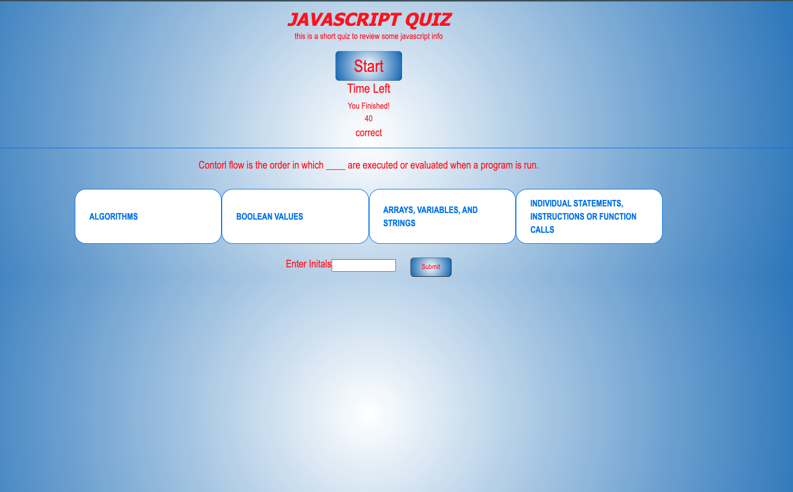

# javascript-trivia-game
a java script trivia game developed as a homework exercise in week 4 of the edX bootcamp at u of Oregon

## Description

This webpage as developed as a homework exercise for the edX Bootcamp at University of Oregon in November of 2023. It is a quiz on some pieces Javascript and API information learned during the course, and demonstrates the student's ability to manipulate the DOM and utilize Javascript to build a more complete user experience.

<!--  -->

[Deployed Page: https://garrett-lieb.github.io/javascript-trivia-game/]

[ Garrett Lieb GITHUB REPO: https://github.com/garrett-lieb/javascript-trivia-game ]

## Installtion

N/A

## Usage

The user starts the quiz by clicking the "START" button at the top of the page and selects answers with the mouse from multiple choice options.
At the end of the quiz the user is given the option to enter their initials and a score is logged to the screen using local storage. 
When the Chrome DevTools are opened by pressing Command+Option+I (macOS) or Control+Shift+I(Windows), the user can see Javascript running.

## Credits

functions renderBlanks() and checkAnswer() were created during a tutoring session with edX/ of Orgeon bootcamp tutor Rene Trevino on Friday, Nov 24, 2023. 

functions to displayscores() and getinitals() were created during a tutoring session with edX/ of Orgeon bootcamp tutor Armenuhi Avanesyan on Friday, Dec 1, 2023.

## Liscence 

MIT License

Copyright (c) 2023 Garrett Lieb

Permission is hereby granted, free of charge, to any person obtaining a copy of this software and associated documentation files (the "Software"), to deal in the Software without restriction, including without limitation the rights to use, copy, modify, merge, publish, distribute, sublicense, and/or sell copies of the Software, and to permit persons to whom the Software is furnished to do so, subject to the following conditions:

The above copyright notice and this permission notice shall be included in all copies or substantial portions of the Software.

THE SOFTWARE IS PROVIDED "AS IS", WITHOUT WARRANTY OF ANY KIND, EXPRESS OR IMPLIED, INCLUDING BUT NOT LIMITED TO THE WARRANTIES OF MERCHANTABILITY, FITNESS FOR A PARTICULAR PURPOSE AND NONINFRINGEMENT. IN NO EVENT SHALL THE AUTHORS OR COPYRIGHT HOLDERS BE LIABLE FOR ANY CLAIM, DAMAGES OR OTHER LIABILITY, WHETHER IN AN ACTION OF CONTRACT, TORT OR OTHERWISE, ARISING FROM, OUT OF OR IN CONNECTION WITH THE SOFTWARE OR THE USE OR OTHER DEALINGS IN THE SOFTWARE.